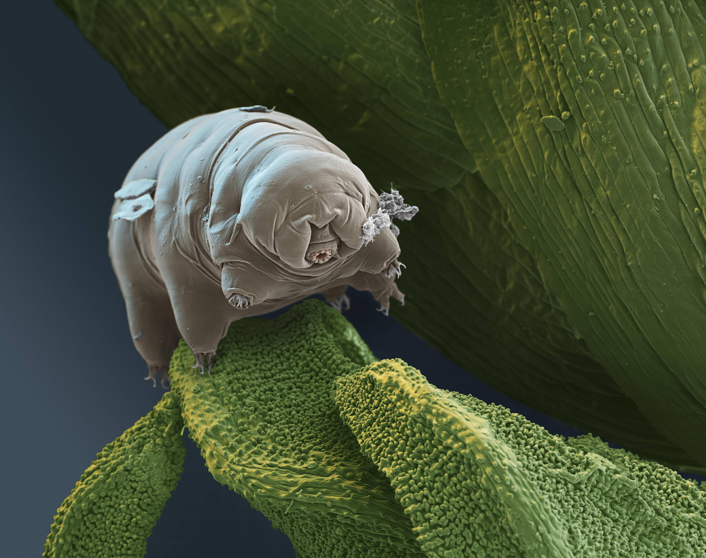

# `waterbear`, A Base Classs That Makes Python Dictionary Accessible With The Dot Notation, Recursively and with Default Values

Now introducing the smallest bear! **Waterbear**.

Waterbear makes it easy to use python dictionaries with dot notation!

## TODOs

- [ ] fix class extension usage pattern
- [ ] ~~merge `python2.7` version with `python3`~~
- [ ] ~~make another package called `tardigrade `~~

## Installation 

```python
pip install waterbear
```

## Usage

For more usage examples, take a look at the [test.py](./waterbear/test_waterbear.py)!

There are two classes, the `Bear` and the `DefaultBear`. Default Bear allows you to pass in a
default factory as the first argument. `Bear` allows you do do so via a keyword argument `__default`

Example usage below:

```python
# Waterbear is a bear!
from waterbear import Bear

waterbear = Bear(**{"key": 100})
assert waterbear.key == 100, 'now waterbear.key is accessible!'
assert waterbear['key'] == 100, 'item access syntax is also supported!'
```

### Similar to `collection.defaultdict`, there is `DefaultBear`

```python
bear = DefaultBear(None, a=10, b=100)
assert vars(bear) == {'a': 10, 'b': 100}

assert bear.does_not_exist is None, "default value works"
```

### DefaultBear like `defaultdict`

You can use the `DefaultBear` class and pass in a default factor as the first parameter.

```python
bear = DefaultBear(tuple, a=10, b=100)
assert bear.does_not_exist is (), "default factory also works!"
```

### You can also use it with `vars`, `str`, `print(repr)`, `dict` etc.

```python
bear = Bear(a=10, b=100)
assert str(bear) == "{'a': 10, 'b': 100}"
assert dir(bear) == ['a', 'b']
assert list(iter(bear)) == ['a', 'b']
assert dict(bear) == {'a': 10, 'b': 100}
```

### As A Base Class

Waterbear is completely rewritten to play well with class extension!

```python
class ExtendBear(Bear):
    @property
    def _hidden_stuff(self):
        return "._hidden_stuff"

    @property
    def __mangled_stuff(self):
        return ".__mangled_stuff"

    @property
    def __dict__(self):
        return ".__dict__"

e = ExtendBear()
assert e.__dict__ == ".__dict__"
assert e._hidden_stuff == '._hidden_stuff'
assert e._ExtendBear__mangled_stuff == ".__mangled_stuff"
```
### More Usages Could Be Found in The Tests!

For more usage examples, take a look at [test.py](./waterbear/test_waterbear.py).

```python
test_dict = {
    'a': 0,
    'b': 1
}

# Use spread operators to construct with a dictionary!
test_args = Bear(**test_dict)
assert test_args.a == 0
assert test_args.b == 1
# the value should now be accessible through the key name.
test_args.haha = 0
assert test_args.haha == 0


# You can also use a nested dictionary.
test_args.haha = {'a': 1}
assert test_args.haha != {'a': 1}
assert vars(test_args.haha) == {'a': 1}
assert test_args.haha.a == 1
assert test_args.__dict__['haha']['a'] == 1
assert vars(test_args)['haha']['a'] == 1
assert str(test_args) == "{'a': 0, 'b': 1, 'haha': {'a': 1}}", \
    'test_args should be this value "{\'a\': 0, \'b\': 1, \'haha\': {\'a\': 1}}"'

# To set recursion to false, use this `__recursive` parameter.
test_args = Bear(__recursive=False, **test_dict)
assert test_args.__is_recursive == False
assert test_args.a == 0
assert test_args.b == 1
test_args.haha = {'a': 1}
assert test_args.haha['a'] == 1
assert test_args.haha == {'a': 1}

# Some other usage patterns
test_args = Bear(**test_dict, **{'ha': 'ha', 'no': 'no'})
assert test_args.ha == 'ha', 'key ha should be ha'
```

## To Develop

```python
git clone https://github.com/episodeyang/waterbear.git
cd waterbear
make dev
```

This `make dev` command should build the wheel and install it in your current python environment. Take a look at the [./Makefile](./Makefile) for details.

**To publish**, first update the version number, then do:
```bash
make publish
```

\* image credit goes to BBC [waterbear: The Smallest Bear!](http://www.bbc.com/earth/story/20150313-the-toughest-animals-on-earth) 😛

