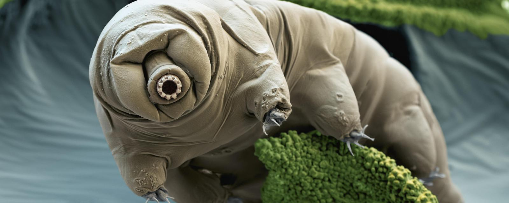

# `waterbear`, A Utility That Makes Python Dictionary Accessible With The Dot Notation

Now introducing the smallest bear! **Waterbear**.

Waterbear makes it easy to use python dictionaries with dot notation!

## Todos
- [ ] merge `python2.7` version with `python3`
- [ ] make another package called `tardigrade `

## Installation 

```python
pip install waterbear # unfortuantely, tardigrade wouldn't work.
```
## Usage
For more usage examples, take a look at the [test.py](./waterbear/test_waterbear.py)
```python
# Waterbear is a bear!
from waterbear import Bear

waterbear = Bear(**{"key": 100})
assert waterbear.key == 100, 'now waterbear.key is accessible!'


test_dict = {
    'a': 0,
    'b': 1
}

# Use spread operators to construct with a dictionary!
test_args = Bear(**test_dict)
assert test_args.a == 0
assert test_args.b == 1
# the value should now be accessible through the key name.
test_args.haha = 0
assert test_args.haha == 0


# You can also use a nested dictionary.
test_args.haha = {'a': 1}
assert test_args.haha != {'a': 1}
assert vars(test_args.haha) == {'a': 1}
assert test_args.haha.a == 1
assert test_args.__dict__['haha']['a'] == 1
assert vars(test_args)['haha']['a'] == 1
assert str(test_args) == "{'a': 0, 'b': 1, 'haha': {'a': 1}}", \
    'test_args should be this value "{\'a\': 0, \'b\': 1, \'haha\': {\'a\': 1}}"'

# To set recursion to false, use this `__recursive` parameter.
test_args = Bear(__recursive=False, **test_dict)
assert test_args.__is_recursive == False
assert test_args.a == 0
assert test_args.b == 1
test_args.haha = {'a': 1}
assert test_args.haha['a'] == 1
assert test_args.haha == {'a': 1}

# Some other usage patterns
test_args = Bear(**test_dict, **{'ha': 'ha', 'no': 'no'})
assert test_args.ha == 'ha', 'key ha should be ha'
```

## To Develop

```python
git clone https://github.com/episodeyang/waterbear.git
cd waterbear
make dev
```

This `make dev` command should build the wheel and install it in your current python environment. Take a look at the [./Makefile](./Makefile) for details.

**To publish**, first update the version number, then do:
```bash
make publish
```

\* image credit goes to BBC [waterbear: The Smallest Bear!](http://www.bbc.com/earth/story/20150313-the-toughest-animals-on-earth) 😛

